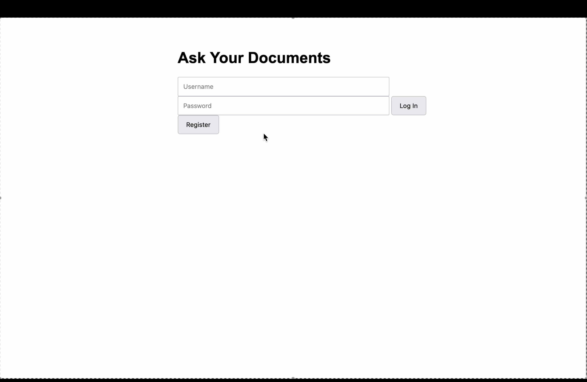
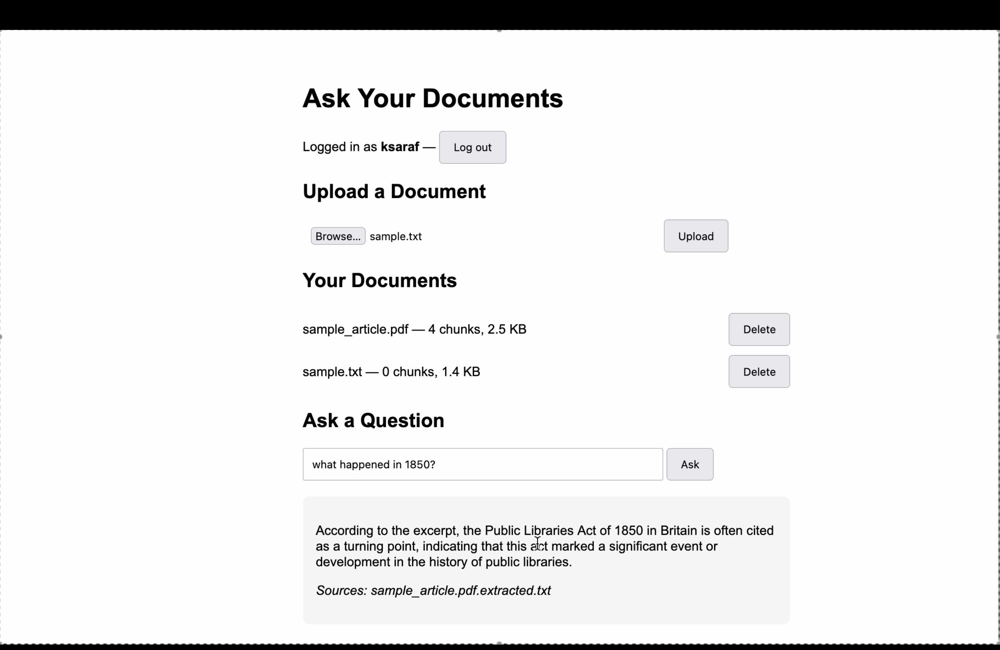
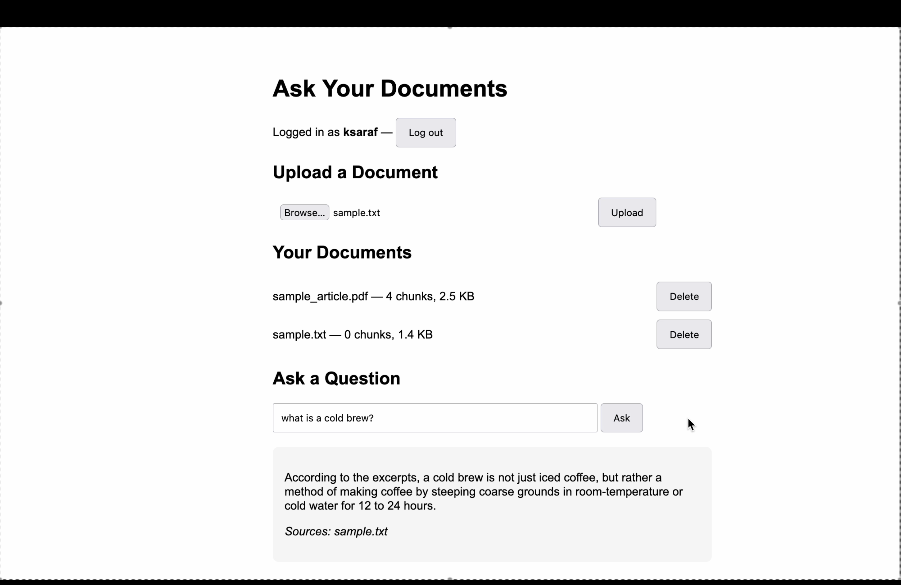
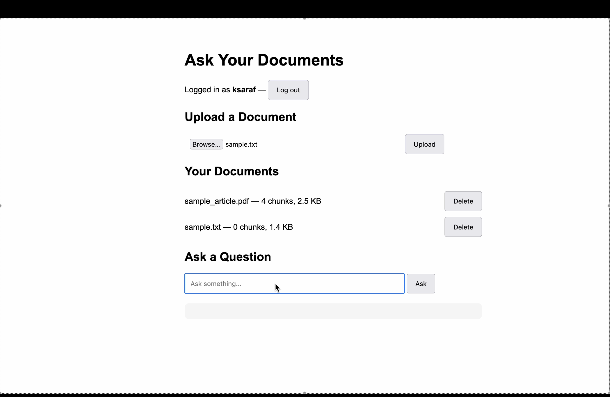

# AI Document Assistant

A full-stack RAG (Retrieval-Augmented Generation) application that lets you upload your own documents — text files, images, and PDFs — and ask questions about them in plain English. The AI answers using *your* content, not just what it memorized during training, and cites exactly which document each answer came from.

Everything runs 100% locally and for free, powered by open-source AI models through [Ollama](https://ollama.com) — no API keys, no per-request costs, no data leaving your machine.

## Demo

## Screenshots
## Screenshots

**Logging in:**


**Asking a question, with cited sources:**


**Another example, pulling from a different document:**


**Managing your uploaded documents:**


## Why I Built This

After a first full-stack project (a basic expense tracker), I wanted something that would teach me real AI engineering concepts rather than just more CRUD. This project covers the core pattern behind most production AI products: turning unstructured documents into something an AI can actually search and reason over, wrapped in a real authenticated application.

## Features

- **Ask questions about your own documents** — the AI retrieves the most relevant content before answering, and shows its sources
- **Multi-format uploads** — plain text, images, and text-based PDFs all feed into the same search pipeline
- **Image understanding** — a vision model reads and describes uploaded images (including embedded text), making photos and screenshots searchable
- **PDF text extraction** — real text-based PDFs are parsed automatically; scanned PDFs with no extractable text are cleanly rejected
- **Per-user private libraries** — full authentication with hashed passwords and JWT tokens; each user only ever searches their own uploaded documents
- **Document management** — list everything you've uploaded, with chunk counts, and delete anything you no longer want indexed
- **Fully local AI** — no OpenAI/Anthropic API costs; all models run on your own machine via Ollama

## How It Works

Uploading a document doesn't just save it — it gets converted into something searchable:

1. **Chunking** — the document's text is split into overlapping ~500-character pieces, so long documents can still be searched precisely
2. **Embedding** — each chunk is converted into a vector (a list of numbers representing its meaning) using a local embedding model
3. **Retrieval** — when you ask a question, it's embedded the same way, then compared against every chunk using cosine similarity to find the most relevant ones
4. **Generation** — the most relevant chunks are handed to a local language model, which writes an answer grounded in that specific content

Images and PDFs are converted to plain text *once*, at upload time, and from that point on are treated exactly like any other document — images are described by a vision model, and PDFs have their embedded text extracted directly, before either ever reaches the search pipeline.

```
User (browser)
     |
     v
HTML / CSS / JavaScript frontend
     |
     v
FastAPI backend  <---- JWT auth (per-user access)
     |
     +--> Upload: chunk + embed document (Ollama: nomic-embed-text)
     |         |--> Image: describe with vision model (Ollama: qwen2.5vl)
     |         |--> PDF:   extract text (pypdf)
     |
     +--> Ask: embed question -> cosine similarity search -> top matches
     |         -> generate answer (Ollama: llama3.2)
     |
     v
JSON response (answer + sources)
     |
     v
Frontend
```

## Tech Stack

**Backend:** Python, FastAPI, SQLite (user accounts), JWT (pyjwt), Argon2 password hashing (pwdlib), pypdf
**AI models (via Ollama, all local):**
- `llama3.2` — answer generation
- `nomic-embed-text` — embeddings for semantic search
- `qwen2.5vl:3b` — image description / OCR
**Frontend:** HTML, CSS, vanilla JavaScript

## API Endpoints

| Method | Endpoint | Purpose |
|---|---|---|
| POST | `/register` | Create an account |
| POST | `/login` | Log in, receive a JWT access token |
| POST | `/documents/upload` | Upload a `.txt`, image, or text-based `.pdf` |
| GET | `/documents` | List your uploaded documents and chunk counts |
| DELETE | `/documents/{filename}` | Remove a document from your library |
| POST | `/ask` | Ask a question; returns an answer and its sources |

## Running Locally

### 1. Install [Ollama](https://ollama.com) and pull the required models

```bash
ollama pull llama3.2
ollama pull nomic-embed-text
ollama pull qwen2.5vl:3b
```

### 2. Clone the repository

```bash
git clone https://github.com/ksaraf07/ai-document-assistant.git
cd ai-document-assistant
```

### 3. Set up a virtual environment and install dependencies

```bash
python3 -m venv .venv
source .venv/bin/activate
pip install -r requirements.txt
```

### 4. Create a `.env` file with a secret key

```bash
python3 -c "import secrets; print(secrets.token_hex(32))"
```

Paste the output into a `.env` file:

```
SECRET_KEY=your_generated_key_here
```

### 5. Start the backend

```bash
uvicorn api:app --reload
```

The API runs at `http://127.0.0.1:8000`, with interactive docs at `http://127.0.0.1:8000/docs`.

### 6. Open the frontend

Open `index.html` directly in your browser (or serve it with VS Code's Live Server extension).

## What I Learned

This project was my introduction to real AI engineering: embeddings and semantic search, retrieval-augmented generation, chunking strategy and its tradeoffs, prompt construction, and running open-source models locally. Beyond the AI-specific pieces, it also deepened my backend skills significantly past my first project — real authentication with password hashing and JWT tokens, protecting routes with FastAPI dependencies, structuring per-user data, and handling file uploads safely (extension validation, filename sanitization, size limits). Debugging real issues — memory pressure from multiple loaded models, silent validation failures, stale frontend state — taught me as much as any of the individual features did.

## Possible Future Improvements

- Deploy with a hosted model API for a public live demo
- Automated tests for the API endpoints
- Support for `.docx` and scanned PDFs (via OCR)
- Streaming responses instead of waiting for the full answer


